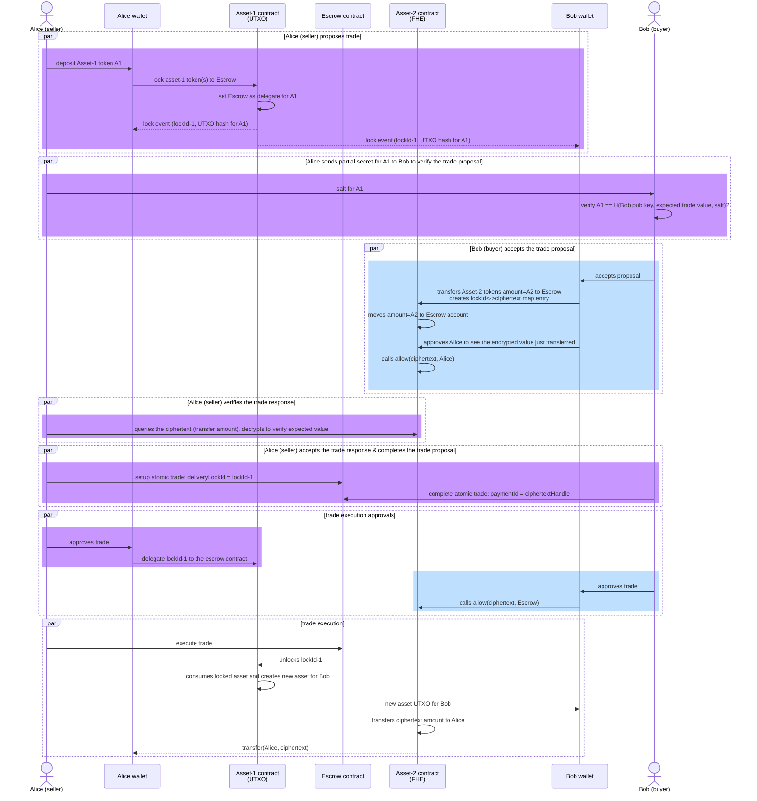

# Secure Multi-leg Atomic Settlements of Privacy Enhancing Tokens

This document is a proposal of an ERC for performing multi-leg settlements among an arbitrary number of privacy enhancing tokens, in a secure and atomic manner.

## The Privacy Enhancing Tokens Landscape

A number of privacy enhancing token designs exist in the Ethereum ecosystem today. This proposal is designed to accommodate different styles of privacy token designs. Below we briefly review the two mainstream designs of privacy enhancing tokens, along with some influential implementations for each.

### Homomorphic Encryption based Tokens

This category of tokens protect the confidentiality of the onchain states and transaction payloads with encryption. In particular, homomorphic encryption is used that enables operations to be performed onchain against the states. These encryption schemes provide the ability for the smart contracts to operate on the ciphertexts, and more crucially, to enforce spending policies such as mass conservation and non-negative balances, purely with onchain components.

> We are using the term "onchain components" above in a loose sense. Some essential components like the co-processor for performing the computation intensive FHE operations may be considered trusted offchain components. But given they are part of the "protocol" set up, rather than requiring client-side, or wallet-side, components like is the case with commitments based tokens, we call them "onchain components" for brevity.

This category of tokens tend to use an account model for managing the onchain states, where a map of account addresses and encrypted balances is maintained by the token contract. 

The encryption scheme must be a fully homomorphic encryption (FHE) system, to support all the necessary operations onchain, including arithmetic comparisons that are crucial to enforce token spending policies, without requiring clients to submit proofs of correct encryption.

Implementations of encryption based tokens include:

- OpenZeppelin’s [ERC7984 implementation](https://github.com/OpenZeppelin/openzeppelin-confidential-contracts/tree/master/contracts/token)
- Inco's [Confidential ERC20 framework](https://github.com/Inco-fhevm/confidential-erc20-framework/tree/main), in collaboration with Circle Research
- Fhenix's [FHERC20](https://github.com/FhenixProtocol/fhenix-contracts/blob/main/contracts/experimental/token/FHERC20/FHERC20.sol)

The samples in this repo are built with the 1st implementation on the list above.

### Commitment based Tokens

This category of tokens protect the confidentiality of the onchain states and transaction payloads by using commitments. The commitments represent the onchain states either with hashing or encryption. When processing transactions, the smart contract relies either completely or partially on a ZKP submitted by the sender to guarantee correctness of the state transitions.

#### Hash (non-homomorphic) based Commitments

If the commitments are based on hashes, no operations can be performed on the commitments during state transition. The smart contract must completely rely on a ZKP submitted by the transaction sender to verify if the state transitions are proposed correctly, obeying all spending rules such as mass conservation and entitlement.

Due to the disjoint nature of the commiments, the state model is inevitablely **UTXO** (Unspent Transaction Output) based. This model has the advantage of supporting parallel processing, where the same spending account can submit many transactions simultaneously, each consuming a different collection of the account's UTXOs. This means these tokens do not suffer from the concurrent spending limits as the tokens based on homomorphic commitments do.

Many privacy tokens fit in this category, including:
- Zcash
- Railgun
- Aztec
- LFDT's Paladin's [Noto](https://github.com/LFDT-Paladin/paladin/tree/main/solidity/contracts/domains/noto) and [Zeto](https://github.com/LFDT-Paladin/zeto) tokens

The samples in this repository are built with the Zeto token implementation.

#### Homomorphic Commitments

If the commitments are based on additive homomorphic encryption, or homomorphic commitment (such as Pedersen commitment), the smart contract can perform additions on the commitments. However, the smart contract must still rely on ZKPs to guarantee correctness of the calculated commitments, such as mass conservation and entitlement. The homomorphic property of the commitment scheme makes it possible to "roll up" all the state commitments for an account to a single commitment, rather than staying as individual commitments, thus resulting in more efficient storage usage. However these token designs suffer from limited throughput due to the concurrency requirement between the proof-generating client and the onchain verification logic.

Examples includes:
- [Zether](https://github.com/Consensys/anonymous-zether), based on additively homomorphic encryption with ElGamal
- Solana's [Confidential Transfer](https://www.solana-program.com/docs/confidential-balances), based on Pedersen commitments
- Avalanche's [Encrypted ERC-20](https://github.com/ava-labs/EncryptedERC), based on a custom partially homomorphic encryption scheme

## Atomic Settlements b/w Privacy Tokens

To demonstrate atomic settlements among privacy tokens, exemplary token implementations are selected to represent the major design patterns in the current privacy enhancing tokens landscape, as described above. In particular, an implementation from the FHE based design was selected, Openzeppelin's Confidential ERC20, and an implementation from the commitment based design was selected, LFDT's Zeto token.

Among the two tokens, 3 types of settlement flows can be implemented:

- Confidential ERC20 vs. Confidential ERC20
- Confidential ERC20 vs. Zeto
- Zeto vs. Zeto

The examples in this repository will demonstrate that a generic locking based settlement mechanism can be developed to support the major design patterns of privacy enhancing tokens, in multi-leg atomic settlement flows.

The repository contains the following smart contract interfaces that need to be implemented in the privacy token contract to make the settlement flow work:
- `ILockableConfidentialERC20`: as a demonstration for how Confidential ERC20 token implementations can be enhanced to support locking, where a portion of an account's balance is locked during the settlement period, such that only the designated `delegate` account can perform transfers on the locked amount. During the lock period, even the account owner is prevented from transferring the locked amount, thus keeping the committed values for a proposed trade/swap safe until settlement time.

```solidity
function createLock(bytes32 lockId, address receiver, address delegate, externalEuint64 amount, bytes calldata proof, bytes calldata data) external;
function delegateLock(bytes32 lockId, address newDelegate, bytes calldata data) external;
```

- `ILockableConfidentialUTXO`: as a demonstration of how commitments based token implementations can support locking.

```solidity
function createLock(
    bytes32 lockId,
    LockParameters calldata parameters,
    bytes calldata proof,
    address delegate,
    LockOperationData calldata settle,
    LockOperationData calldata rollback,
    bytes calldata data
) external;

function delegateLock(
    bytes32 lockId,
    address newDelegate,
    bytes calldata data
) external;
```

Both of the above interfaces extend the following generic lock interface, which is also used by the settlement orchestration contract to drive the settlement operations against the privacy tokens:
- `ILockable`: with a simple interface that provides two functions, `settleLock` and `rollbackLock`, to be called to either proceed with settlement or to rollback. Each operation uses the `lockId` to signal to the target privacy token contract the lock to operate on.

```solidity
function settleLock(bytes32 lockId, bytes calldata data) external;
function rollbackLock(bytes32 lockId, bytes calldata data) external;
```

Finally, a settlement orchestration contract implementation, `Atom`, is provided. The Atom contract must be initialized once with all the legs of the settlement, with each leg represented by an `Operation` object.

### Successful Settlement Flow #1 - Confidential ERC20 vs. Confidential UTXO

The diagram below illustrates a full settlement flow that results in the successful settlement between two 


